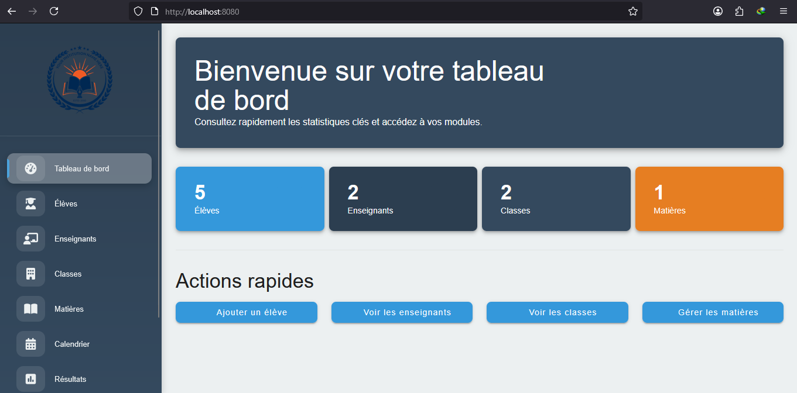
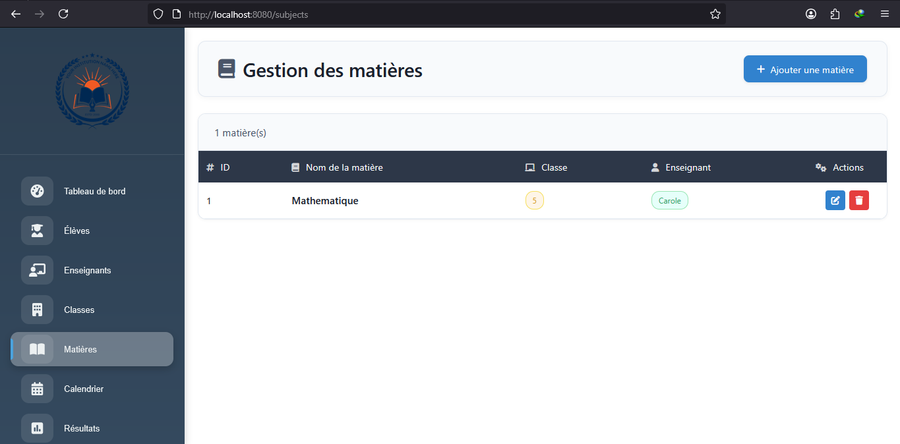

# Captures d'écran

Voici quelques captures d'écran de l'application :

| Page | Capture |
|------|--------|
| Accueil |  |
| Liste des classes |  |
| Liste des élèves |  |
| Liste des enseignants |  |
| Liste des matières |  |
# School Management

Ce projet est une application de gestion scolaire moderne développée avec Vue.js et Vuetify pour le frontend, et Node.js pour le backend.

## Fonctionnalités principales
- Gestion des élèves, enseignants, classes, matières, emplois du temps, résultats, notifications, etc.
- Interface utilisateur moderne et responsive grâce à Vuetify.
- Navigation simple via Vue Router.

## Structure du projet
```
APP/
  backend/           # Backend Node.js (API, serveur)
  public/            # Fichiers statiques
  src/               # Code source Vue.js
    assets/          # Images et ressources
    components/      # Composants Vue (pages, UI)
    router/          # Configuration des routes
  package.json       # Dépendances et scripts frontend
  ...
```

## Prérequis
- Node.js (v16 ou supérieur recommandé)
- npm

## Installation et lancement (Frontend)
1. Ouvrir un terminal dans le dossier `APP` :
   ```powershell
   cd APP
   npm install
   npm run serve
   ```
2. Ouvrir le navigateur à l'adresse indiquée (généralement http://localhost:8080)

## Lancement du backend (si utilisé)
1. Ouvrir un autre terminal dans `APP/backend` :
   ```powershell
   cd backend
   npm install
   node index.js
   ```

## Personnalisation
- Les composants sont dans `src/components`.
- Le style principal est géré par Vuetify.
- Modifiez les pages ou ajoutez des fonctionnalités selon vos besoins.

## Dépendances principales
- [Vue.js](https://vuejs.org/)
- [Vuetify](https://vuetifyjs.com/)
- [Node.js](https://nodejs.org/)

## Auteur
- Projet scolaire, modernisé avec GitHub Copilot.

---
N'hésitez pas à adapter ce README selon vos besoins ou à ajouter des instructions spécifiques à votre projet.

# Anciennes instructions Vue CLI

## Project setup
```
npm install
```

### Compiles and hot-reloads for development
```
npm run serve
```

### Compiles and minifies for production
```
npm run build
```

### Lints and fixes files
```
npm run lint
```

 